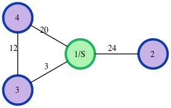

# Desafio 10: Dijkstra - Menor Distância em Grafos

## Desafio
Dado um grafo não direcionado e um nó inicial, determine o comprimento dos caminhos mais curtos do nó inicial para todos os outros nós no grafo. Se um nó for inacessível, sua distância é -1. Os nós serão numerados consecutivamente de 1 a n, e as arestas terão distâncias variáveis.

## Detalhamento do Desafio:
1. Crie uma função chamada shortestReach que tem os seguintes parâmetros:
- int n: o número de nós no grafo.
- list of lists edges: uma lista 2D de inteiros onde cada sublista consiste em três inteiros que representam o nó inicial e final de uma aresta, seguido pelo comprimento dela.
- int s: o número do nó inicial.
2. Retorne uma lista de inteiros que representam a distância mais curta para cada nó a partir do nó inicial, em ordem crescente do número do nó.

## Exemplo

Entrada: 
- n = 4
- edges = [(1, 2, 24), (1, 4, 20), (3, 1, 3), (4, 3, 12)]
- s = 1
Saída:
- "24 3 15"

Explicação:
O grafo fornecido é representado pela imagem abaixo, onde as linhas são arestas ponderadas e o peso denota o comprimento da aresta.



Os caminhos mais curtos seguidos para os três nós 2, 3 e 4 são calculados a partir do nó inicial 1 (S). Aqui está o cálculo detalhado:

Caminho para o nó 2: O caminho direto de 1/S para 2 tem um comprimento de 24.
- Caminho mais curto: 1/S -> 2
- Comprimento do Caminho Mais Curto: 24

Caminho para o nó 3: O caminho direto de 1/S para 3 tem um comprimento de 3.
- Caminho mais curto: 1/S -> 3
- Comprimento do Caminho Mais Curto: 3

Caminho para o nó 4: Existem dois caminhos possíveis:
- 1/S -> 4 com comprimento de 20
- 1/S -> 3 -> 4 com comprimento de 3 + 12 = 15
- Caminho mais curto: 1/S -> 3 -> 4
- Comprimento do Caminho Mais Curto: 15
Portanto, as distâncias mais curtas dos nós 2, 3 e 4 a partir do nó inicial 1 (S) são 24, 3 e 15, respectivamente. Para os nós inatingíveis, a distância seria -1, mas não há nós inatingíveis neste caso.

Portanto, considerando as distâncias mais curtas obtidas:

Nó 2: 24
Nó 3: 3
Nó 4: 15

A resposta final é a string de distâncias separadas por espaço: "24 3 15"

## Quais conhecimentos eu preciso adquirir para resolver este desafio?
- Teoria dos Grafos: Aprenda sobre grafos e como representá-los em estruturas de dados.

## Testes
Após criar o seu código, abra o terminal, vá até a pasta que está seu script, e execute o comando abaixo.

```
python nome-do-seu-script.py
```

Você pode então realizar alguns testes em seu script. Execute seu script usando os valores abaixo, para ver se ele se comporta como esperado.

### Teste 1:
- Entrada: n = 4, edges = [(1, 2, 24), (1, 4, 20), (3, 1, 3), (4, 3, 12)], s = 1
- Saída Esperada: "24 3 15"

### Teste 2:
- Entrada: n = 5, edges = [(1, 2, 10), (1, 3, 6), (2, 4, 8)], s = 2
- Saída Esperada: "10 16 8 -1"

### Teste 3:
- Entrada: n = 6, edges = [(1, 2, 7), (1, 3, 9), (1, 6, 14), (2, 3, 10), (2, 4, 15), (3, 4, 11), (3, 6, 2), (4, 5, 6), (5, 6, 9)], s = 1
- Saída Esperada: "7 9 20 20 11"

### Teste 4:
- Entrada: n = 3, edges = [(1, 2, 1), (2, 3, 1)], s = 1
- Saída Esperada: "1 2"

### Teste 5:
- Entrada: n = 4, edges = [(1, 2, 1), (2, 3, 2), (3, 4, 3)], s = 2
- Saída Esperada: "1 2 5"

## Dicas Extras:
- Dicionários para Armazenamento de Grafos: Utilize dicionários para representar grafos como listas de adjacência, permitindo um acesso rápido e eficiente aos vizinhos de cada nó. Cada chave do dicionário representa um nó, e o valor é uma lista de tuplas, onde cada tupla representa um nó vizinho e o peso da aresta conectando-os. Isso facilita a atualização e a consulta das distâncias dos nós adjacentes durante a execução do algoritmo.
- Otimize a Busca com Filas de Prioridade: Quando implementar o algoritmo de Dijkstra, use uma fila de prioridade para manter os nós a serem explorados. Isso ajuda a retirar sempre o nó com a menor distância estimada até agora, melhorando significativamente a eficiência. Pode usar o módulo heapq
- Tratamento de Nós Inacessíveis: Inicialize as distâncias para todos os nós, exceto o nó inicial, como infinito (ou um valor muito alto). Ao final do algoritmo, verifique se algum nó ainda tem essa distância infinita e substitua por -1 para indicar que o nó é inacessível.